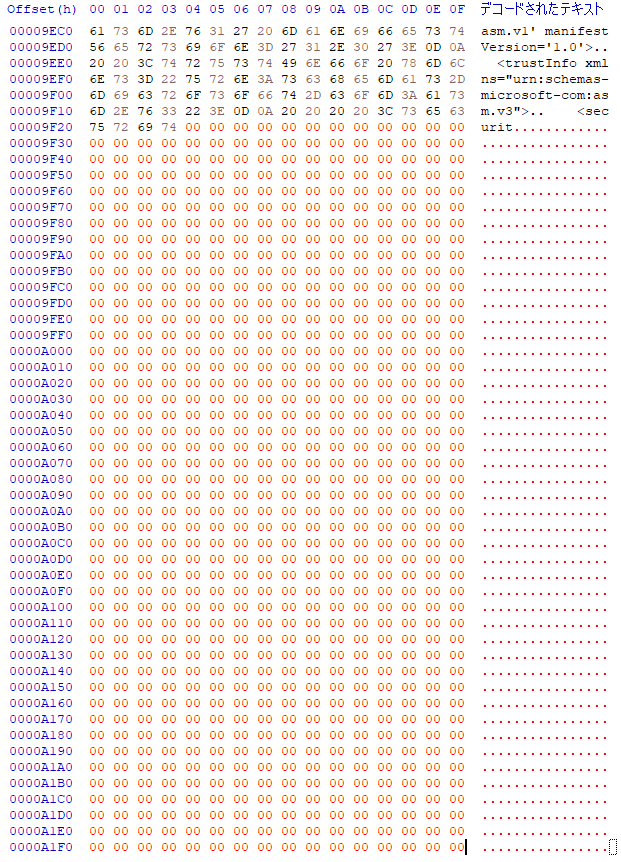
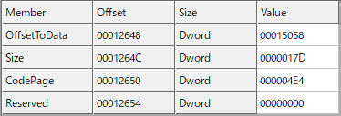
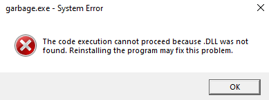
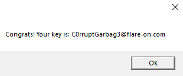

2 - garbage

# Challenge 2 - garbage

To start off this challenge, trying to run the provided garbage.exe yields:


Viewing its PE header in CFF Explorer we can see that it was compressed with UPX:


However, running upx -d garbage.exe to decompress it yields the following error:


Looking back at the resource directory, the ```Raw Address + Raw Size = 0xA200```, however the actual .exe file is only ```0x9F24``` bytes. By extending the image ```0x2DC``` bytes to make it ```0xA200``` bytes large like so, UPX will work:



However the image will still not run:


Looking at the side-by-side configuration at the bottom of the last hex dump, we can see that the XML file is incomplete. Replacing it with a complete version of the correct size (```0x17D``` bytes, retrieved below again from CFF Explorer) will remove the previous error:



```xml
<?xml version='1.0' encoding='UTF-8' standalone='yes'?>
<assembly xmlns='urn:schemas-microsoft-com:asm.v1' manifestVersion='1.0'>
   <trustInfo xmlns="urn:schemas-microsoft-com:asm.v3">
     <security>
        <requestedPrivileges>
          <requestedExecutionLevel level='asInvoker' uiAccess='false' />
        </requestedPrivileges>
     </security>
   </trustInfo>
</assembly>
```

But now we have yet another new error:


Checking the import table, we can see that the .dll names are missing:


Adding them in fixes the .exe and it will now run correctly:




Flag: `C0rruptGarbag3@flare-on.com`