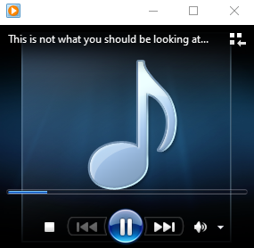

# Challenge 4 - report

The provided `report.xls` for this challenge has VBA macros that mess around with data inside the Microsoft Office document.

The python tool [olevba](https://github.com/decalage2/oletools/wiki/olevba) is capable of exporting these scripts, as well as any other interesting data, and providing a summary of what it found. Below is sample summary:

```
+----------+--------------------+---------------------------------------------+
|Type      |Keyword             |Description                                  |
+----------+--------------------+---------------------------------------------+
|AutoExec  |Auto_Open           |Runs when the Excel Workbook is opened       |
|AutoExec  |Workbook_Open       |Runs when the Excel Workbook is opened       |
|Suspicious|Environ             |May read system environment variables        |
|Suspicious|Open                |May open a file                              |
|Suspicious|Write               |May write to a file (if combined with Open)  |
|Suspicious|Put                 |May write to a file (if combined with Open)  |
|Suspicious|Binary              |May read or write a binary file (if combined |
|          |                    |with Open)                                   |
|Suspicious|CreateObject        |May create an OLE object                     |
|Suspicious|Lib                 |May run code from a DLL                      |
|Suspicious|Chr                 |May attempt to obfuscate specific strings    |
|          |                    |(use option --deobf to deobfuscate)          |
|Suspicious|Xor                 |May attempt to obfuscate specific strings    |
|          |                    |(use option --deobf to deobfuscate)          |
|Suspicious|Hex Strings         |Hex-encoded strings were detected, may be    |
|          |                    |used to obfuscate strings (option --decode to|
|          |                    |see all)                                     |
|IOC       |wininet.dll         |Executable file name                         |
|IOC       |winmm.dll           |Executable file name                         |
|Suspicious|VBA Stomping        |VBA Stomping was detected: the VBA source    |
|          |                    |code and P-code are different, this may have |
|          |                    |been used to hide malicious code             |
+----------+--------------------+---------------------------------------------+

```
It also output several VBA macro functions (```rigmarole```, ```folderol```, ```canoodle```), and a p-code decompilation of the compiled VBA script. Note the warning at the bottom of the output suggesting that this decompiled p-code differes from the VBA source code macros.

The main function of the script is ```folderol```, which calls ```rigmarole``` to decode the .xls form data called "F.L", which stores the following strings:
```r
1:  AppData
2:  \Microsoft\stomp.mp3
3:  play
4:  FLARE-ON
5:  Sorry, this machine is not supported.
6:  FLARE-ON
7:  Error
8:  winmgmts:\\.\root\CIMV2
9:  SELECT Name FROM Win32_Process
10: vbox
11: WScript.Network
12: \Microsoft\v.png
```
After getting the strings, it makes some external library calls to make sure there is an internet connection and that it is not being run in a virtual machine (note the 5th and 10th strings above).
Next, it decodes the form data "F.T" using ```canoodle``` and the XOR key ```[0x11, 0x22, 0x33, 0x44, 0x55, 0x66, 0x77, 0x88, 0x99, 0xAA, 0xBB, 0xCC, 0xDD, 0xEE]```, and saves it to the file ```AppData\Microsoft\stomp.mp3```.

When we re-implement the macros in Python, the script creates the file __stomp.mp3__:




So that was the wrong solution. Reading the decompiled p-code, there are a few differences between it and the VBA macro. Mainly, the XOR key it uses to decode data is different. The VBA macro source code uses the bytes ```[0x11, ...,  0xEE]```, whereas the decompiled p-code uses the byte string key ```b'NO-ERALF'```. Here is a sample of the decompiled p-code that creates this key, followed by the re-implementation in python:

Decompiled VBA p-code:
```vb
LitDI2 0x000A 
ArgsLd onzo 0x0001 
ArgsLd rigmarole 0x0001 
ArgsLd CreateObject 0x0001 
Set groke 
Ld groke 
MemLd UserDomain 
St firkin 
...
Ld firkin 
FnLen 
St n 
StartForVariable 
Ld i 
EndForVariable 
LitDI2 0x0001 
Ld n 
For 
Ld firkin 
Ld i 
LitDI2 0x0001 
ArgsLd Mid$ 0x0003 
ArgsLd Asc 0x0001 
Ld n 
Ld i 
Sub 
ArgsSt buff 0x0001 
StartForVariable 
Next
```
Python implementation:
```py
firkin = rigmarole(onzo[3])
n = len(firkin)
for i in range(0, n):
    buff[n - i - 1] = ord(firkin[i:i+1])
```
Note that in the p-code, the ```firkin``` variable is the ```UserDomain``` acquired from a ```WScript.Network``` call (check the decoded string list above at line 11), which needs to be ```FLARE-ON``` to succeed.

The fully implemented Python script saves the decoded data as the file __v.png__:


Flag: `thi5_cou1d_h4v3_b33n_b4d@flare-on.com`

&nbsp;

Click here for the python script:
[report.py](../_resources/report.py)

